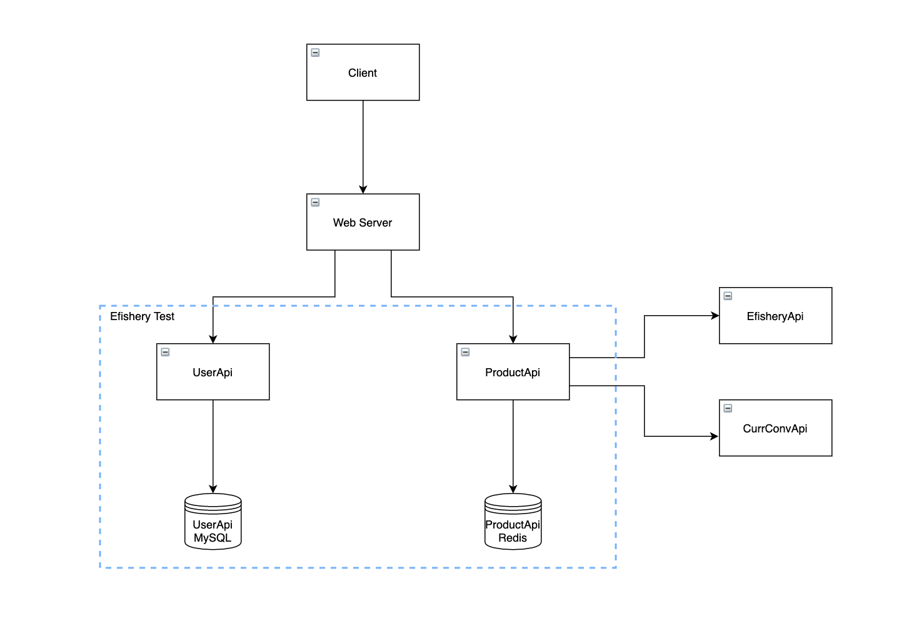

# efishery_test

## Description

Efishery Test is a repository for Efishery Test Assignment. Its a group of web-service apps. It's using **Go** and **NodeJS** as its programming language.

## Architecture Diagram

## Setup

Efishery Test has 4 directory fot its own use.

### Docs
This directory is used to store the yaml file for openapi documentation.

### Standalone-migration
Standalone-migration will be used for db migration. To setup this standalone-migration you can see it [here](standalone-migration/README.md)

### User_api
User_api is a web-service to store user data and used for authentication. To setup this user_api you can see it [here](user_api/README.md)

### Product_api
Product_api is a Product storerages web-service that request the data from Efishery API. To setup this product_api you can see it [here](user_api/README.md)
